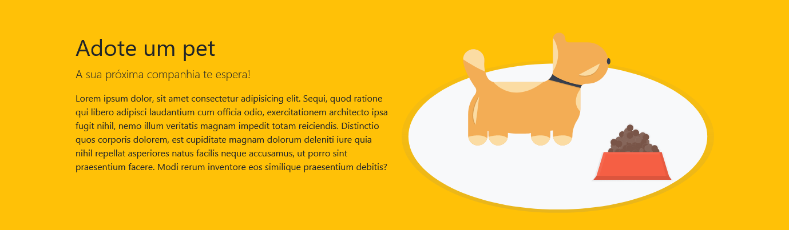

# 🐾 Adote um Pet

## Sobre o projeto

Primeiro projeto feito com o Bootstrap 5.
A ideia principal foi criar uma página simples que pudesse servir de base para futuros projetos.
Alguns conceitos de acessibilidade foram aplicados na página.

## Objetivos

- Entender como funciona o Bootstrap
- Praticar conceitos básicos de posicionamento, responsividade e colunas do Bootstrap
- Experimentar o uso de cards com imagens e textos
- Começar a usar algumas ferramentas de acessibilidade

<!-- ## Página Completa

 -->
